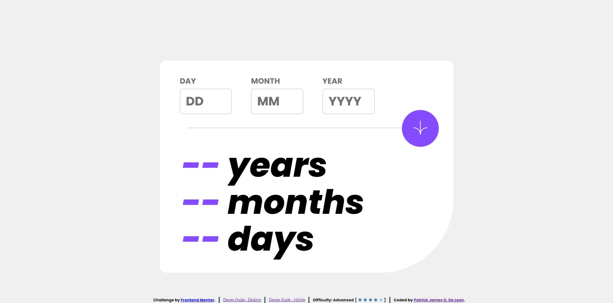

# Frontend Mentor - QR code component solution

This is a solution to the [Age calculator app challenge on Frontend Mentor](https://www.frontendmentor.io/challenges/age-calculator-app-dF9DFFpj-Q/). Frontend Mentor challenges help you improve your coding skills by building realistic projects.

## Table of contents

- [Overview](#overview)
  - [Screenshot](#screenshot)
  - [Links](#links)
- [My process](#my-process)
  - [Built with](#built-with)
  - [What I learned](#what-i-learned)
- [Author](#author)

## Overview

### Screenshot

### Links

- Solution URL: [Github](https://github.com/EcePJD/frontendMentor_ageCalculator)
- Live Site URL: [Github.io](https://ecepjd.github.io/frontendMentor_ageCalculator/)

## My process
FIrst, I properly organized the index.html contents to fit my envisioned html organization that is advantageous to the CSS approach I used after. As usual, I used flexBox CSS to easily organized the elements. Next, I added a false return callback to the onsubmit event of the form to prevent refresh / reload of the page. I attached the main function ( handles the verification of the date entered and the computation of the age ) as a callback in my submit button. After, is alot of formula tweaking that includes the leap years passed from the birthdate entered until now. I also incldued a notifier below the div on how many leap years a person encountered in his life until now.

### Built with
- Semantic HTML5 markup
- CSS custom properties
- Mobile-first workflow
- Javascript
- Javascript DOM

### What I learned
Since its been a year since I last programmed (because of WoRk), I was able to refresh a lot about the javascript DOM.

## Author

- Github - [@EcePJD](https://github.com/EcePJD)
- Frontend Mentor - [@EcePJD](https://www.frontendmentor.io/profile/EcePJD)
- Facebook - [@ECEPJDeLeon](https://www.facebook.com/ECEPJDeLeon)